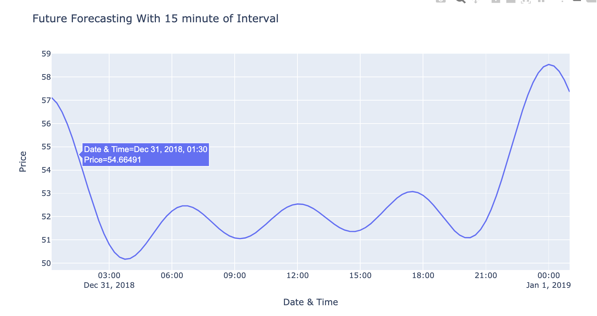
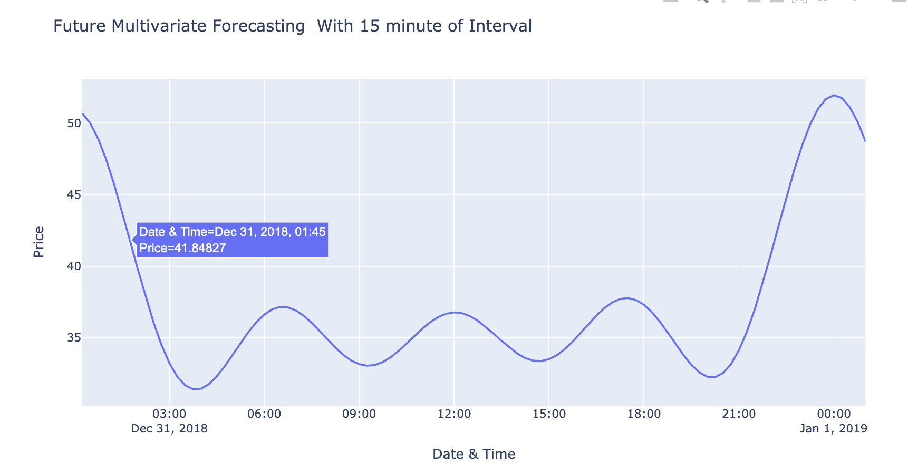

# ------- Electricity Imbalance Price Forecasting ---------
## ------------ DEFINE ----------
## Background:
  - Electricity systems need generation and supply to always be equal.
  - To facilate this National Grid (ESO), requests each generator and supplier to inform in advance about their planned generation or demand, respectively.
  - Imbalance Volume for each generator/supplier = (Planned - Actual) generation/demand.
  - Imbalance Price in units of £/MWh --> The cost National Grid incurrs/take in Correcting the electricity system imbalance.
  - Generators and Suppliers pay or get paid the Imbalance Price depending on the direction of their imbalance volume.
### BATTERY
  - Get PAID the Imbalance Price by over-Discharging or under-charging (i.e. discharging or charge more than the planned discharge or charge communicated to National Grid).
  - A Battery can PAY the Imbalance Price by under-discharging or over-charging.
  - This is sometimes a very attractive opportunity given the large range of imbalance prices.
  - However, imbalance prices are not known in advance.

## Objectives/Goals:
1. Exploring the data, identify the main factors that influence the imbalance price (for example, by correlating the imbalance price with other variables).
2. Develop a model that predicts the imbalance price 15 minutes before the settlement period starts.

## Approach & Stratergies:
1. Load Required Datasets
2. Data Discover or Data Understanding
3. Data Pre-processing and Preparation
- 3.1 Data Merging
- 3.2 Scaling Data i.e. All Features with MWh unit
- 3.3 Handle Missing Values
### -------- Part A: Identify Main Factors Influence Imbalance Price ----------------
1. Identify Correlated Features With Pearson Correlation and Visualization
2. Verify the factors with Spearman Correlation
3. Select and Document Main Factors Influence Imbalance Price
### -------- Part B: Developed Model Predicts Imbalance Price 15 minute Before -----------
1. Univariate forecasting
2. Multivariate forecasting
## ------------------ Key TakeAway Or Results -------------------------
### Part A:
- Top 5 Main Factors influence Imbalance Price
  1. net_imbalance_volume
  2. Market_Price
  3. Ahead_Auction_Price
  4. Demand
  5. Hydropower

### Part B:

